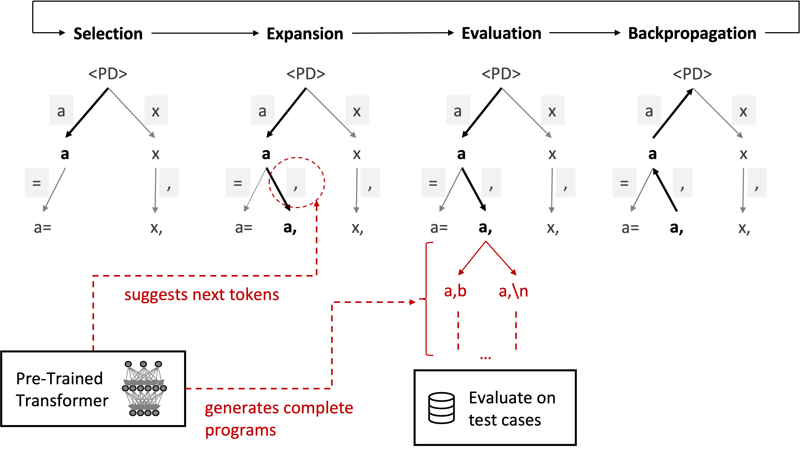

# Measuring Coding Challenge Competence With APPS
This is the repository for **Planning with Large Language Models for Code Generation** (accepted at ICLR 2023). This codebase is modified from Dan Hendrycks's [APPS](https://github.com/hendrycks/apps) repository.
The tree search algorithm is modified from the [Dyna Gym](https://github.com/SuReLI/dyna-gym) repository.

## Framework



## Environment Setup

Install the environment by running the following command. We use an Anaconda environment with Python 3.8.
```
pip install -r requirements.txt
```
We specified the torch+CUDA version that we used. Other versions may work as well. Our codebase also works without GPU, but the Transformer decoding will be significantly slower.

## Data and Model Preparation

### Download Manually

1. Download the [APPS dataset here](https://people.eecs.berkeley.edu/~hendrycks/APPS.tar.gz) (~1.3GB).
This repository contains both training and test codes. Extract it in this directory. It should appear as `APPS/`.

2. Fine-tuned GPT-2 1.5B and GPT-Neo 2.7B weights are [available here](https://drive.google.com/file/d/1XW1Od9L-5l9zXl1HUCyER5pS9zQTbIvU/view?usp=sharing).
Extract it in this directory. It should appear as `models/`.

3. (To run CodeContests experiments) We have converted the test set of [CodeContests](https://github.com/deepmind/code_contests.git) dataset to the APPS format for easier processing. They are [available here](https://drive.google.com/file/d/1iUf5l-F0CAEC7HYHFOPuWDhua54fi_Hz/view?usp=sharing) (20MB, it only contains the test set).
Extract it in this directory. It should appear as `CodeContests/`.

### Download Using Command Line

If you prefer to download the data and models using the command line, you may run the following commands.
```
# Download APPS dataset
wget https://people.eecs.berkeley.edu/~hendrycks/APPS.tar.gz
tar xvzf APPS.tar.gz

# Download GPT-2 1.5B and GPT-Neo 2.7B weights
pip install gdown # you may use any other download tool to download from Google Drive
gdown 1XW1Od9L-5l9zXl1HUCyER5pS9zQTbIvU
tar xvzf models.tar.gz

# Download CodeContests dataset
gdown 1iUf5l-F0CAEC7HYHFOPuWDhua54fi_Hz
tar xvzf CodeContests_test.tar.gz
```

## Check Installation / Test Runs

After downloading the APPS dataset and the GPT models above, you may use `APPS/test/4136` for sanity check. It's a simple A+B question (see `APPS/test/4136/question.txt`).

The following runs **beam search**. the result is saved as `results/4136.json`.
```
cd generate
python synthesis_exp.py -i 4136 --alg bs
```
The following runs **PG-TD** using default parameters as in Table 1, performing 16 rollouts in tree search.
We add the prefix `t-` to the output file name to distinguish it from the beam search result. The result is saved as `results/t-4136.json`.
```
python synthesis_exp.py -i 4136 --alg mcts --rollout 16 --prefix t-
```

The following runs **Sampling + Filtering**, generating 16 samples.
The result is saved as `results/s-4136.json`.
```
python synthesis_exp.py -i 4136 --alg sample --num-samples 16 --prefix s-
```

The following runs **Sequential Monte Carlo-Guided Transformer Decoding (SMCG-TD)**, which has 10 partial programs in the population.
```
python synthesis_exp_smc.py -i 4136 --pop-size 10 --prefix smc-
```
The scripts above will print the pass rates (rewards) and other statistics at the end of the run.

### Tips
You may run the algorithms above to solve a batch of programs. The following runs beam search on the first 10 APPS introductory-level problems, with the problem ID from 4000 to 4009.
the results are saved as `results/[4000-4009].json`.
```
python synthesis_exp.py -s 4000 -e 4010 --alg bs
```
You may add the `--debug` argument to generate more verbose output. For PG-TD, it will print all complete programs found during the evaluation steps in PG-TD (the codes generated by the Transformer beam search algorithm). It will also save the search tree as `results/t-4136.log.pdf`. It is a tree with 16 nodes other than the root node (our saved tree is [here](figures/t-4136.log.pdf)).
```
python synthesis_exp.py -i 4136 --alg mcts --rollout 16 --prefix t- --debug
```
By default, the script skips generation if the output file already exists. You may use `--rerun` to force regeneration.

Once the `json` files are generated, you may also use `test_solution.py` to review the results without regenerating the solutions.
The following command assumes `results/[4000-4009].json` are already generated.
```
python test_solution.py -s 4000 -e 4010
```


## Run All Experiments

We conducted the experiments on the IBM CCC and AiMOS servers, which use LSF and Slurm job submission systems respectively. If you use one of these submission systems, you should be able to run the following scripts directly.
Otherwise, you may look at `generate/scripts/basis.sh` and see if you need to define a new `submit` command to submit jobs to the computation clusters that you use.

### Main Results (Table 1)

The following shell scripts reproduce results in the main paper.

```
cd generate

# Seam Search
./scripts/beam/run.sh

# Sampling + Filtering
./scripts/sampling/run.sh

# Sequential Monte Carlo-Guided Transformer Decoding (SMCG-TD)
./scripts/smc/run.sh

# Planning-Guided Transformer Decoding (PG-TD)
./scripts/mcts/run.sh
```
Note that each script runs the corresponding algorithm on both APPS (5000 problems) and CodeContests (165 problems) datasets, using both GPT-2 and GPT-Neo models. You may change the range of problems to run by changing the `$start` and `$end` variables and/or comment out models that you do not want to use in these files.

### Other Results

These experiments require passing in some additional arguments to `synthesis_exp.py`. The following shell scripts reproduce some other results in the paper.

PG-TD using different hyper-parameters:
```
./scripts/mcts/run_para_search.sh
```
Variations of PG-TD (using sampling instead of beam search, using different numbers of public test cases):
```
./scripts/mcts/run_variants.sh
```
Running PG-TD using Codex model. You'll need an OpenAI API key for this. Save the key in `transformer_utils/openai_api_key` and run:
```
./scripts/mcts/run_codex.sh
```
